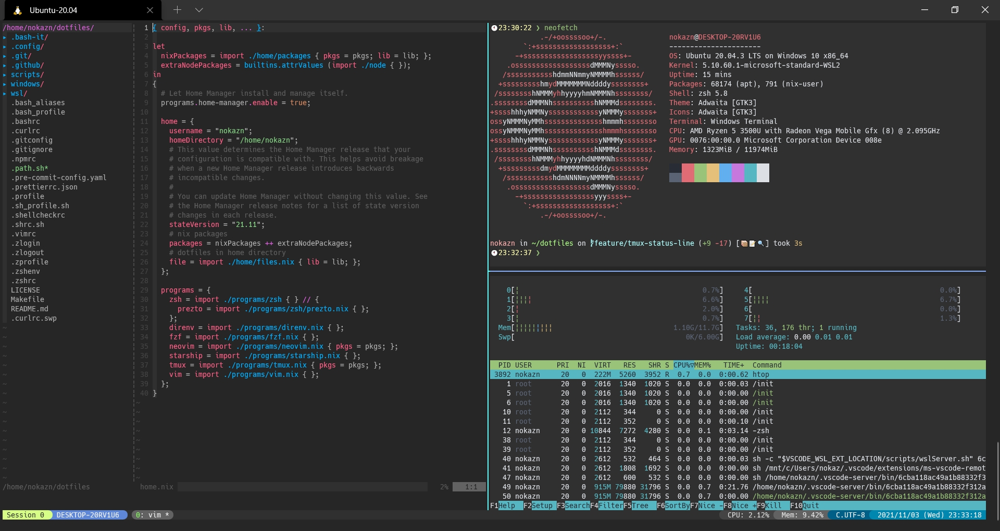

# dotfiles

[](https://github.com/nokazn/dotfiles/actions/workflows/static-check.yml)

[](./images/screenshot1.jpg)

## Installation

If `git`, `make`, `gcc`, `curl`, `wget`, `unzip` and `xz-utils` are not available in your environment, you need to install these packages.

```bash
# Ubuntu/Debian
$ sudo apt update;
$ sudo apt install -y git make gcc curl wget unzip xz-utils
```

`make deploy` command makes symbolic links to files that starting with a dot and followed 2 or more chars in `~/dotfiles/` directory.  
If a existing file conflicts with the symbolic link, this is backed up in `~/dotfiles_backup/` directory.

`make init` command executes targets below.

- `update-apt` - Update apt packages
- `packages-apt` - Install apt packages
- `add-tools`
  - `add-nix` - Add nix
  - `add-home-manager` - Add home-manager
  - `add-dein-vim` - Add dein-vim
  - `add-bash-it` - Add bash-it
  - `add-wsl-hello-sudo` - Add wsl-hello-sudo
- `install-anyenv` - Install anyenv
- `install-langs`
  - `install-deno` - Install Deno
  - `install-rust` - Install Rust
  - `install-elm` - Install Elm
  - `install-nim` - Install Nim

```bash
$ git clone git@github.com:nokazn/dotfiles ~/dotfiles
$ cd ~/dotfiles
$ make init
```

After `make init` has completed, you can source paths and execute `make install-anyenv-langs`.

```bash
$ source ~/.path.sh
$ make install-anyenv-langs
```

## Configuration

### Set up wsl-hello-sudo

After installing wsl-hello-sudo, you need to modify `/etc/pam.d/sudo`.

```diff
+ auth  sufficient pam_wsl_hello.so
```

See [wsl-hello-sudo document for configuration](https://github.com/nullpo-head/WSL-Hello-sudo#configuration) for details.

### Change default shell

```bash
$ chsh -s "$(which zsh)"

# or

$ chshs zsh  # defined in .bash_aliases
```

### Daemonize Docker on WSL

```bash
$ sudo visudo
```

```diff
+ <Your Username> ALL=(ALL) NOPASSWD:/home/<Your Username>/.nix-profile/bin/daemonize
```

then, you can run `daemonize` command without sudo privileges on booting WSL.
