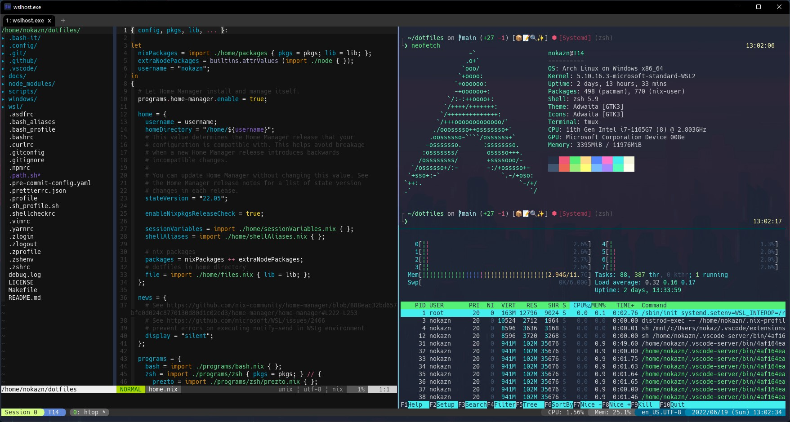

# dotfiles

[](https://github.com/nokazn/dotfiles/actions/workflows/static-check.yml)

[](./docs/img/arch-linux.jpg)

## Installation

```sh
# Generate SSH key (and then need to register public key to GitHub)
$ mkdir -p ~/.ssh/github.com && \
  ssh-keygen -t rsa -b 4096 -C nokazn@gmail.com -f ~/.ssh/github.com/id_rsa -N "" && \
  cat ~/.ssh/github.com/id_rsa.pub
$ curl https://raw.githubusercontent.com/nokazn/dotfiles/main/unix/.ssh/config > ~/.ssh/config
$ ssh -T github.com

$ sudo tee /etc/wsl.conf <<EOF
[user]
default = nokazn
EOF

$ sudo mkdir -p /etc/nix && sudo tee /etc/nix/anix.conf <<EOF
experimental-features = nix-command flakes
EOF
```

### For user environment

```sh
# Ubuntu/Debian
$ sudo apt update -y && sudo apt upgrade -y && sudo apt install -y git make wget curl

# Arch Linux
$ sudo pacman -Syu && sudo pacman -S base base-devel vi vim git make wget openssh
```

`make init/user` command executes targets below.

- `add-tools/nix` - add Nix
- `apply/user` - run `home-manager switch`
- `install/asdf-langs` - install asdf-vm and some languages by it

```sh
$ git clone git@github.com:nokazn/dotfiles ~/dotfiles
$ cd ~/dotfiles

# Install all development tools & language runtime
$ make init/user
# For WSL environment (optional)
$ make deploy/windows
```

install apps for Windows

```powershell
# After running `deploy/windows` in WSL environment, run the following script in powershell
.\.scripts\deploy.ps1
```

Install apps for Linux

```sh
./scripts/flatpak.sh
```

### For darwin

`make init/darwin` command executes targets below.

- `add-tools/nix` - add Nix
- `apply/darwin` - run `nix-darwin switch`
- `install/asdf-langs` - install asdf-vm and some languages by it

```sh
$ git clone git@github.com:nokazn/dotfiles ~/dotfiles
$ cd ~/dotfiles

# Install all development tools & language runtime & homebrew apps
$ make init/darwin
```

## Configuration

### Change default shell

```bash
# `chshs` is an alias for `chsh -s`
$ chshs zsh
```

### Set up wsl-hello-sudo (optional)

```bash
# Add wsl-hello-sudo
$ make add-tools/wsl-hello-sudo
```

After installing wsl-hello-sudo, you need to modify `/etc/pam.d/sudo`.

```diff
+ auth  sufficient pam_wsl_hello.so
```

See [wsl-hello-sudo document for configuration](https://github.com/nullpo-head/WSL-Hello-sudo#configuration) for details.

### Import a GPG key

```sh
# Login to keybase
$ keybase login
# If no service
$ keybase --standalone login

$ keybase config set -b pinentry.disabled 1

# Import a public key
$ keybase pgp export | gpg --import
# Import multiple public keys
$ keybase pgp export -q <ID> | gpg --import

# Import a secret key
$ keybase pgp export --secret | gpg --allow-secret-key-import --import
```
